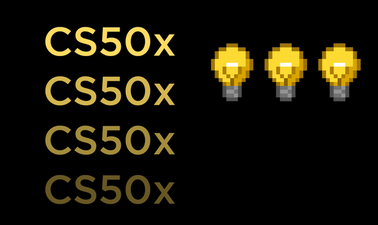

# CS50's Introduction to Computer Science

Este repositório contém as soluções para os problemas do curso CS50 de harvard, um curso oferecido pela Fundação Estudar aqui no Brasil. Cada conjunto de problemas explora diferentes conceitos e linguagens, mostrando meu progresso ao longo do curso.

## Problem Sets

### [Problem Set 1 - C](https://github.com/LevyMatias/CS50x/tree/main/pset1)

- `Hello`
- `Cash`
- `Credit`
- `Mario`

### [Problem Set 2 - Arrays C](https://github.com/LevyMatias/CS50x/tree/main/pset2)

- `Caesar`
- `Readability`

### [Problem Set 3 - Algorithms C](https://github.com/LevyMatias/CS50x/tree/main/pset3)

- `Plurality`
- `Runoff`

### [Problem Set 4 - Memory C](https://github.com/LevyMatias/CS50x/tree/main/pset4)

- `Filter`

### Problem Set 5 - Data Structures C

- `Speller`
- `Examples`

### Problem Set 6 - Python

- `Examples`
- `Mario (Less)`
- `Mario (More)`
- `Cash`
- `Caesar`

…

Os desafios apresentados em cada conjunto de problemas contribuíram para o meu crescimento como programador e para a minha compreensão de programação e paradigmas.